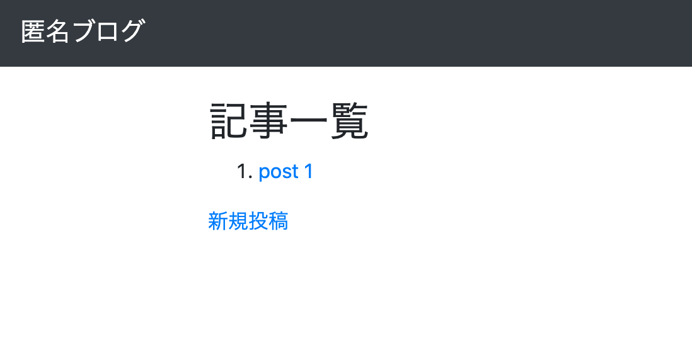
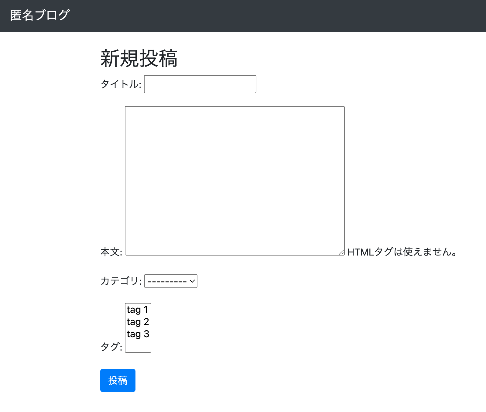
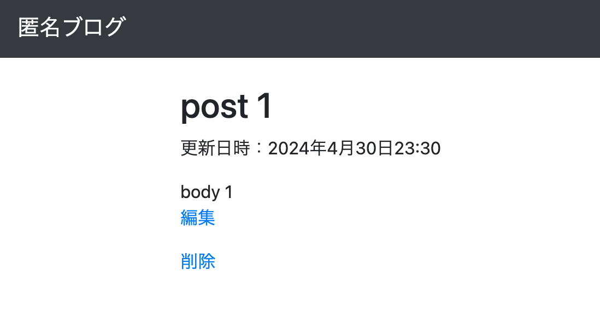
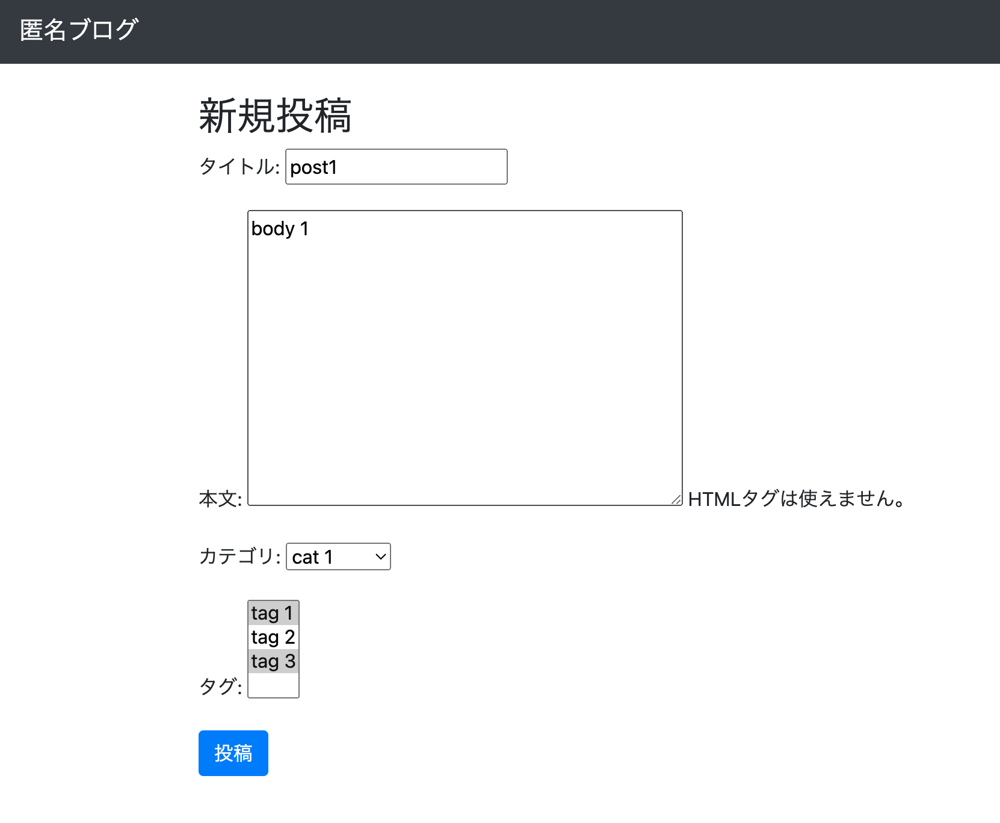
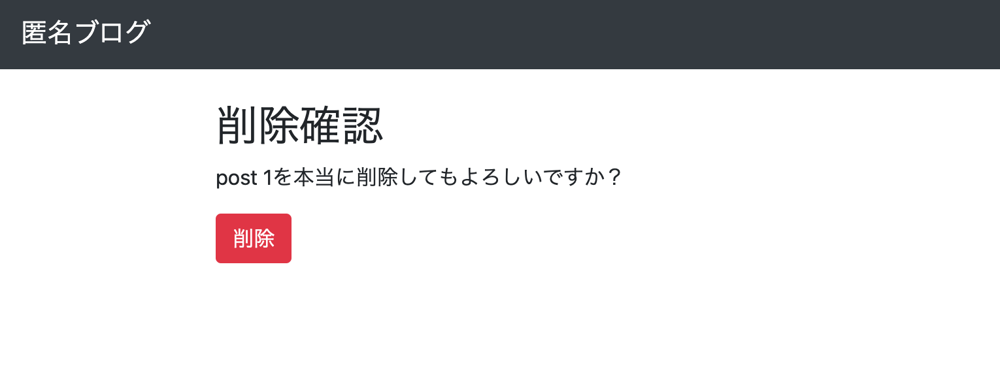
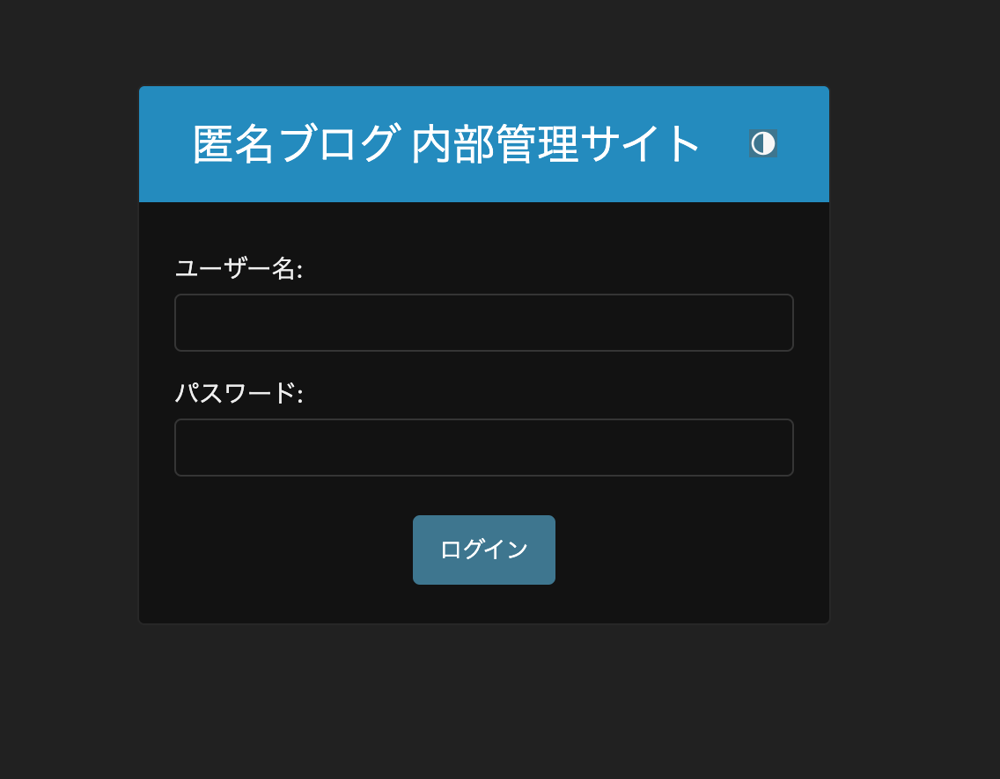
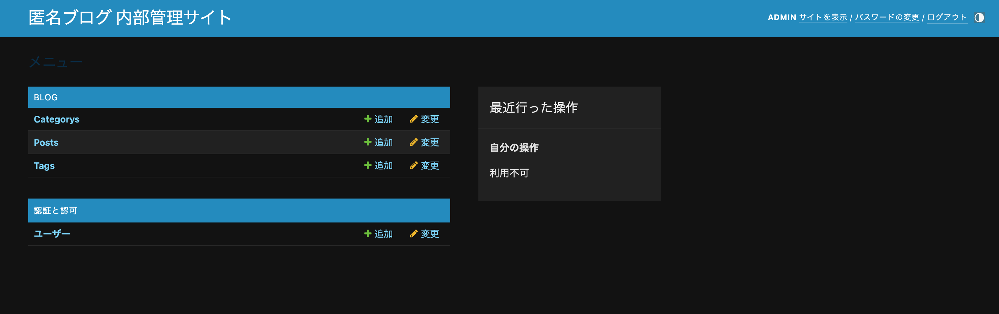

## アプリ紹介
- このアプリはDjango勉強用のアプリです
## 参考
- https://github.com/shun-rec/django-website-07
## 機能
- 管理画面での投稿の確認
- 投稿の登録/変更/削除
- gunicornの使用
- whitenoiseの使用
## 前準備
django shellから以下を実行しカテゴリとタグを作成

django shellの起動
```
python manage.py shell
```
カテゴリとタグとサンプル投稿を作成

django shellで以下をコピーアンドペーストして実行してサンプルデータを作成。

```py
from blog.models import *
cat = Category.objects.create(name="cat 1")
Category.objects.create(name="cat 2")
tag1 = Tag.objects.create(name="tag 1")
tag2 = Tag.objects.create(name="tag 2")
Tag.objects.create(name="tag 3")
post = Post()
post.title = "post 1"
post.body = "body 1"
post.category = cat
post.save()
post.tags.add(tag1)
post.tags.add(tag2)
post.save()
exit
```
## 画面
### 投稿一覧画面

### 新規投稿画面

### 投稿詳細/更新/削除画面



### 管理画面


